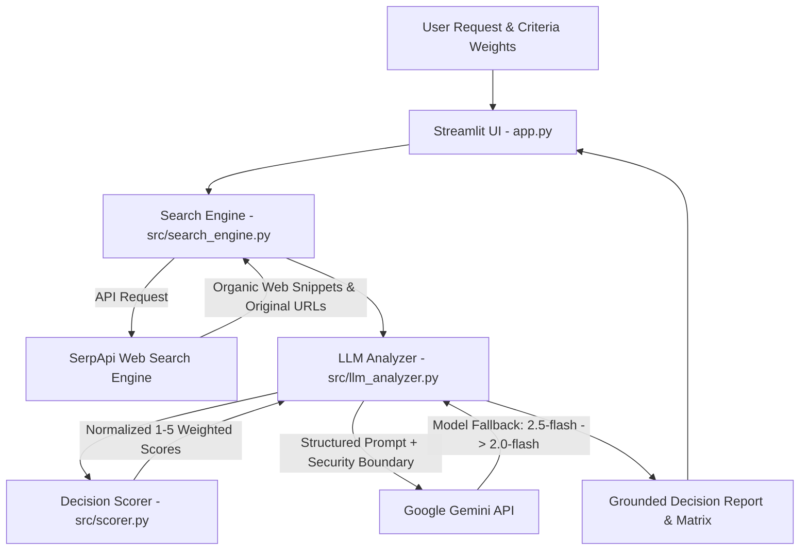

# 🚀 ResearchPilot AI: Evidence-Based Decision Agent

**Official Submission for SerpApi India Hackathon 2026**

ResearchPilot AI is an autonomous, evidence-grounded decision agent. It empowers software architects, technical leads, researchers, and strategic decision-makers to answer high-stakes comparative research questions. By combining **SerpApi Live Web Search** with **Google Gemini Intelligence** and a **Transparent Weighted Scoring Engine**, ResearchPilot AI transforms raw, unstructured web search results into actionable, mathematical decision reports with verifiable source citations.

---

## 🎯 Problem Statement & Solution

### The Challenge
Modern technical and purchasing decisions suffer from:
1. **Search Noise & SEO Bias**: Traditional search engine results are bloated with sponsored marketing content and outdated comparison articles.
2. **LLM Hallucinations**: Standard AI models rely on static training data and hallucinate benchmarks, pricing, or obsolete technical specifications.
3. **Black-Box AI Recommendations**: Most AI chat assistants provide subjective recommendations without explaining *how* or *why* an option scored higher than another.

### The ResearchPilot AI Solution
ResearchPilot AI solves this by introducing a strict 4-stage pipeline:
1. **Real-Time Web Retrieval**: Fetches organic web search results using `serpapi-search-tools`.
2. **Untrusted Data Isolation**: Wraps web evidence in strict prompt boundaries to prevent prompt injection and separate search data from AI instructions.
3. **Transparent Weighted Scoring**: Computes a mathematical weighted matrix $\text{Score} = \frac{\sum w_c \cdot s_c}{\sum w_c}$ normalizing candidate options on a 1.0–5.0 scale against user-defined criteria weights.
4. **Grounded Synthesis & Citation**: Generates a decision report where every factual claim is linked directly to the original, unaltered source URL returned by SerpApi.

---

## 🏗️ System Architecture



---

## ⭐ Key Features & Differentiators

- **Unaltered Direct Source URLs**: Preserves original target URLs from SerpApi organic results without fabricating or truncating links.
- **Transparent Weighted Decision Matrix**: Users can assign criterion importance weights (1 = Minor, 5 = Critical), generating an explainable numerical score breakdown.
- **Untrusted Context Defense**: Search result snippets are treated strictly as external data to prevent prompt override attacks.
- **Resilient Multi-Model Tier Fallback**: Automatic retries and model fallback (`gemini-2.5-flash` $\rightarrow$ `gemini-2.0-flash` $\rightarrow$ `gemini-1.5-flash`) ensure high availability.
- **SaaS-Grade Streamlit Interface**: Features dark glassmorphism styling, preset decision scenarios (*Postgres vs DuckDB*, *Next.js vs Remix*, *LangChain vs LlamaIndex*), expandable evidence inspection, and Markdown report export.

---

## 🛠️ Project Structure

```
ResearchPilot-AI/
├── app.py                     # Streamlit application UI & state manager
├── test_search.py             # Standalone SerpApi integration test
├── requirements.txt           # Dependency manifest
├── .env.example               # Environment variables template
├── README.md                  # Project documentation & Hackathon submission report
├── src/
│   ├── __init__.py
│   ├── search_engine.py       # SerpApi search wrapper & domain extractor
│   ├── llm_analyzer.py        # Gemini client integration & report generator
│   └── scorer.py              # Mathematical decision scoring engine
└── tests/
    ├── test_search_engine.py  # Unit tests for search execution & URL preservation
    ├── test_llm_analyzer.py   # Unit tests for Gemini prompt isolation & fallback
    └── test_scorer.py         # Unit tests for weighted decision scoring math
```

---

## 🚀 Quick Start Guide

### 1. Prerequisites
- Python 3.13+
- SerpApi API Key ([serpapi.com](https://serpapi.com))
- Gemini API Key ([aistudio.google.com](https://aistudio.google.com))

### 2. Setup Environment

```bash
# Clone project repository
git clone <repository-url>
cd ResearchPilot-AI

# Create virtual environment
python -m venv .venv

# Activate virtual environment
# On Windows:
.venv\Scripts\activate
# On Linux/macOS:
source .venv/bin/activate

# Install dependencies
pip install -r requirements.txt
```

### 3. Configure API Keys

Copy `.env.example` to `.env` and insert your API keys:

```env
SERPAPI_API_KEY=your_serpapi_key_here
GEMINI_API_KEY=your_gemini_key_here
```

### 4. Run Unit Tests

Execute the automated test suite (15 tests, 100% mocked external calls):

```bash
python -m unittest discover tests -v
```

### 5. Launch Application

Start the Streamlit web dashboard:

```bash
streamlit run app.py
```

Open your browser to `http://localhost:8501`.

---

## 🧮 Decision Scoring Methodology

ResearchPilot AI uses a normalized weighted scoring model:

$$\text{Overall Score}(O) = \frac{\sum_{c=1}^{N} \text{Weight}(c) \times \text{Score}(O, c)}{\sum_{c=1}^{N} \text{Weight}(c)}$$

Where:
- $\text{Weight}(c) \in [1, 5]$: User-assigned importance for criterion $c$.
- $\text{Score}(O, c) \in [1.0, 5.0]$: LLM-assisted rating of option $O$ against criterion $c$ grounded in search evidence.
- Scores are explicitly labeled as **LLM-assisted estimates derived from snippet evidence**, ensuring transparency.

---

## 📹 Video Demo Script (< 3 Minutes)

| Time | Segment | Script / Visual Guide |
| :--- | :--- | :--- |
| **0:00 - 0:30** | **Hook & Problem** | *"When making high-stakes tech choices like PostgreSQL vs DuckDB, web search gives SEO noise while AI chatbots give ungrounded hallucinations. Meet ResearchPilot AI."* |
| **0:30 - 1:15** | **Live Search & Scoring** | Demonstrate launching a query (*Postgres vs DuckDB for local analytics*) with criterion weights (*Speed=5, Memory=4*). Show SerpApi live search progress. |
| **1:15 - 2:15** | **Decision Matrix & Citations** | Highlight the **Weighted Decision Matrix**, explain the $1-5$ normalized scoring breakdown, and click through verified **SerpApi source URLs**. |
| **2:15 - 2:45** | **Export & Architecture** | Show Markdown report download, architecture diagram, and automated unit test suite passing. |
| **2:45 - 3:00** | **Closing** | *"ResearchPilot AI: Evidence-grounded decisions powered by SerpApi and Gemini. Thank you!"* |

---

## ⚠️ Limitations & Future Roadmap

- **Evidence Scope**: Current version analyzes organic search result snippets returned by SerpApi. Future versions will integrate full HTML page rendering for deeper document scraping.
- **Multi-Query Synthesis**: Multi-step query expansion (deconstructing complex questions into multiple SerpApi search queries) is planned for v2.0.

---

## 🤖 AI-Assisted Development Disclosure

In accordance with hackathon rules, the development of ResearchPilot AI was assisted by:
- **Google Antigravity IDE**: AI agent pair-programming environment used for code architecture, refactoring, and test creation.
- **Gemini 3.6 Flash**: Core LLM model powering agent reasoning and decision synthesis.
- **SerpApi Search Tools SDK (`serpapi-search-tools`)**: Official SDK for real-time web search integration.
