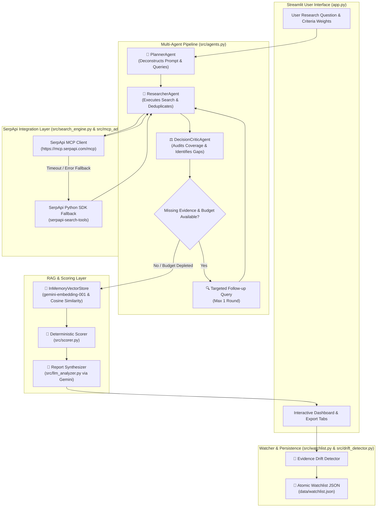

# 🚀 ResearchPilot AI — Multi-Agent Evidence & Decision System

**Official Submission for SerpApi India Hackathon 2026 — AI Agents Track**

ResearchPilot AI is an autonomous, evidence-grounded multi-agent decision framework designed to assist technical leads, software architects, and researchers in making complex comparative decisions. By orchestrating a specialized three-agent workflow (**PlannerAgent**, **ResearcherAgent**, and **DecisionCriticAgent**), ResearchPilot AI retrieves real-time search data via the **SerpApi Model Context Protocol (MCP)** (with automatic SDK fallback), indexes evidence using an in-memory RAG pipeline, and computes a deterministic weighted decision matrix to deliver explainable, grounded recommendations.

---

## 🔗 Project Links & Demonstration

- **Official Hackathon**: [SerpApi India Hackathon 2026 — AI Agents Track](https://serpapi-india-hackathon-2026.devpost.com/)
- **Demo Video**: [Watch ResearchPilot AI Demo Video](https://drive.google.com/file/d/1BWrjzm-QFC4UK1rVhhXiLWmo8NPisKYk/view?usp=drive_link)

---

## 🎯 Problem Statement & Proposed Solution

### The Challenge
When evaluating technologies, frameworks, or vendor solutions, engineers and decision-makers face three core hurdles:
1. **Search Noise & Marketing Bias**: Public search results are frequently saturated with SEO-optimized marketing pages, promotional blog posts, and outdated comparison articles.
2. **AI Hallucinations**: Generic LLM prompts depend on static training cutoff data and often hallucinate benchmark numbers, pricing tiers, or deprecated API capabilities.
3. **Unverified Single-Prompt Outputs**: Standard single-prompt AI assistants cannot audit missing evidence, verify URL sources, or execute targeted follow-up queries when initial search results are incomplete.

### The ResearchPilot AI Solution
ResearchPilot AI replaces unverified single-prompt generation with a structured 5-stage multi-agent pipeline:
- **PlannerAgent**: Deconstructs user decision prompts into candidate options and targeted search queries.
- **ResearcherAgent**: Executes search queries using the official SerpApi Model Context Protocol (MCP) server, deduplicates results by URL, and annotates source metadata.
- **DecisionCriticAgent Audit**: Audits evidence coverage against user criteria and identifies missing information.
- **Bounded Follow-Up Search Loop**: Executes at most one targeted follow-up search when critical criteria lack evidence and query budget permits.
- **In-Memory RAG & Deterministic Scoring Engine**: Ranks passage chunks via vector embeddings and computes mathematical weighted scores in Python to generate an evidence-calibrated report.

---

## ⭐ Key Features & Project Highlights

- **SerpApi Model Context Protocol (MCP) Integration**: Connects to the official SerpApi MCP endpoint (`https://mcp.serpapi.com/mcp`) over JSON-RPC 2.0 transport with automatic failover to the `serpapi-search-tools` Python SDK if the MCP server is unreachable or times out.
- **Multi-Agent Orchestration**: Modular agent workflow dividing query planning, live search execution, evidence auditing, and report synthesis across dedicated agent roles.
- **Deterministic Weighted Decision Matrix**: Computes overall candidate ratings mathematically in Python code rather than relying on LLM-generated overall scores.
- **Lightweight In-Memory RAG Pipeline**: Embeds search snippets into passage chunks using `gemini-embedding-001` and retrieves top passages via cosine similarity ranking, with automatic fallback to raw snippet context if embedding APIs fail.
- **Research Watcher & Evidence Drift Detection**: Tracks monitored research topics over time in a persistent JSON store (`data/watchlist.json`), identifying source URL changes, snippet updates, score shifts, and top candidate rank flips across severity levels (`NONE`, `LOW`, `MEDIUM`, `HIGH`).
- **Bounded Search Budgeting**: Caps total search queries per workflow run (default maximum 4) to ensure fast response times and quota protection.
- **Untrusted Context Defense**: Enforces strict prompt isolation (`<untrusted_web_search_evidence>`) to prevent external web search content from executing instruction overrides.
- **Interactive Streamlit Web Dashboard**: Features preset evaluation scenarios, live agent execution status updates, interactive criteria weight sliders, and structured tabbed views for reports, matrices, verified sources, and watchlist management.

---

## 🏗️ Architecture & Workflow

The following Mermaid diagram illustrates the end-to-end data flow across the Streamlit UI, multi-agent orchestrator, external SerpApi integration, RAG pipeline, scoring engine, and persistent storage.



---

## ⚙️ How ResearchPilot AI Works

The execution flow follows five sequential steps:

1. **Query Planning (PlannerAgent)**: Analyzes the user's research prompt and criteria to extract candidate options and generate 1 to 3 targeted search queries.
2. **Evidence Gathering (ResearcherAgent)**: Sends planned search queries to SerpApi. Incoming organic search results are normalized, tagged with query provenance, and deduplicated by target URL.
3. **Evidence Audit & Follow-Up (DecisionCriticAgent)**: Checks whether the retrieved snippets cover all user-specified criteria. If a key criterion lacks coverage and the search budget has not been reached, the agent triggers one focused follow-up search.
4. **Passage Chunking & Dense Retrieval (RAG Pipeline)**: Search snippets are broken into passage chunks and embedded using `gemini-embedding-001`. Top chunks are retrieved based on cosine similarity match against the query vector.
5. **Deterministic Matrix Computation & Report Generation**:
   - Criterion ratings ($1.0$ to $5.0$) are evaluated against retrieved evidence. Missing evidence criteria receive a neutral baseline rating ($3.0*$).
   - Overall scores are computed deterministically using weighted averaging in Python.
   - The Gemini model synthesizes an executive recommendation with exact markdown citations (`[Source Title](URL)`).

---

## 🔌 SerpApi Integration: MCP Protocol & SDK Fallback

ResearchPilot AI supports dual search execution strategies to maximize reliability:

### Primary Strategy: Official SerpApi Model Context Protocol (MCP)
- **Endpoint**: `https://mcp.serpapi.com/mcp`
- **Transport**: JSON-RPC 2.0 over HTTP POST (`Accept: application/json, text/event-stream`)
- **Authentication**: `Authorization: Bearer SERPAPI_API_KEY`
- **JSON-RPC Methods**: `tools/list` for discovery and `tools/call` with argument `name: "search"` and `engine: "google_light"`.

### Fallback Strategy: SerpApi Python Search Tools SDK
Because external MCP endpoints can experience network latency or service unavailability, the system implements a circuit-breaker pattern in `src/search_engine.py`. If an MCP connection times out (configurable `SERPAPI_MCP_TIMEOUT`, default 3.0 seconds) or returns an HTTP/JSON-RPC error:
1. The system logs a warning and sets an internal `_mcp_unreachable` flag.
2. Search execution seamlessly switches to the local `serpapi-search-tools` Python SDK (`web_search`).
3. Subsequent queries in the session bypass MCP to maintain responsive execution.

> [!IMPORTANT]
> Search evidence is retrieved from live organic web snippets. Snippets represent condensed text returned by search engines and do not full-page render or execute browser scripts. Recommendations should be verified against original source links.

---

## 🧮 Weighted Decision-Scoring Methodology

Overall candidate scores are calculated deterministically in Python code (`src/scorer.py`) using a weighted normalized scoring model.

$$
\text{Overall Score}(O) =
\frac{\sum_{c=1}^{N} \text{Weight}(c)\times\text{Score}(O,c)}
{\sum_{c=1}^{N}\text{Weight}(c)}
$$

Where:
- $N$ is the total number of evaluation criteria.
- $\text{Weight}(c) \in [1, 5]$ is the user-configured weight for criterion $c$.
- $\text{Score}(O, c) \in [1.0, 5.0]$ is the evaluated rating for candidate option $O$ on criterion $c$.
- If search snippets lack evidence for criterion $c$, a default rating of $3.0*$ is assigned and explicitly flagged in the output matrix.

Because overall scores and candidate rankings are calculated mathematically in Python rather than generated by the LLM, overall score rankings are 100% deterministic and reproducible.

---

## 📡 Research Watcher & Evidence-Drift Detection

ResearchPilot AI allows users to save research scenarios to a persistent watchlist (`data/watchlist.json`) to monitor how search evidence and decisions evolve over time.

### Drift Metrics & Severity Thresholds
When a watched topic is re-evaluated, `src/drift_detector.py` compares the new run against the baseline across three dimensions:
1. **Source URL Drift**: Identifies new URLs added, removed URLs, and retained URLs.
2. **Snippet Content Drift**: Identifies text modifications in retained source snippets.
3. **Score & Rank Drift**: Calculates numeric score deltas ($\Delta$) for each candidate and checks if the top-ranked recommendation flipped.

| Severity Level | Trigger Conditions | Action / Meaning |
| :--- | :--- | :--- |
| **`HIGH`** | Top candidate recommendation rank flipped OR maximum score delta $\| \Delta \| > 0.50$ pts | Critical shift in search evidence requiring decision review. |
| **`MEDIUM`** | Score shift detected ($0.0 < \| \Delta \| \le 0.50$ pts) | Moderate rating update without changing top recommendation. |
| **`LOW`** | New or removed URLs / snippet updates detected, but scores unchanged ($\Delta = 0.0$) | Evidence sources updated without altering numerical scores. |
| **`NONE`** | Zero changes in URLs, snippets, or decision scores | Evidence remains identical to baseline. |
| **`ERROR`** | Rerun failed due to network or API quota error | Incomplete refresh; preserves last valid report snapshot. |

Watchlist data is written atomically via temporary files (`tempfile` + `os.replace`) with automatic sanitization of API keys prior to storage. Background re-evaluations can be executed via `scripts/watchlist_runner.py`.

---

## 🛠️ Technology Stack

- **Core Programming Language**: Python 3.10+
- **User Interface**: Streamlit
- **Web Search Integration**: SerpApi Model Context Protocol (MCP) Client & `serpapi-search-tools` Python SDK
- **LLM & Embeddings SDK**: `google-genai` (Google GenAI SDK)
  - **Primary LLM**: `gemini-3.8-flash`
  - **Fallback LLM**: `gemini-2.5-flash`
  - **Embedding Model**: `gemini-embedding-001`
- **Environment & Configuration**: `python-dotenv`
- **Test Suite**: Python `unittest` framework

---

## 📁 Project Directory Structure

```
ResearchPilot-AI/
├── app.py                     # Main Streamlit web application & UI layout
├── requirements.txt           # Python dependency specifications
├── .env.example               # Template for required environment variables
├── README.md                  # Complete project documentation
├── test_search.py             # Basic SerpApi connection test script
├── data/
│   ├── .gitkeep               # Directory placeholder
│   └── watchlist.json         # Persistent watched research scenarios and drift history
├── scripts/
│   └── watchlist_runner.py    # Background CLI script for automated watchlist reruns
├── src/
│   ├── __init__.py
│   ├── agents.py              # Multi-agent orchestrator (Planner, Researcher, DecisionCritic)
│   ├── drift_detector.py      # Evidence URL, snippet, score shift, and rank flip detector
│   ├── llm_analyzer.py        # Gemini prompt builder, response parser, and model fallback
│   ├── mcp_adapter.py         # Official SerpApi Model Context Protocol JSON-RPC client
│   ├── rag_pipeline.py        # In-memory vector store, chunking, and cosine similarity RAG
│   ├── scorer.py              # Deterministic weighted decision scoring engine
│   ├── search_engine.py       # Search wrapper handling MCP attempts and SDK fallback
│   └── watchlist.py           # Atomic JSON persistence and CRUD operations for watchlist
└── tests/
    ├── test_agents.py         # Tests for agent pipeline orchestration and budget caps
    ├── test_drift_detector.py # Tests for drift metrics, score deltas, and rank flips
    ├── test_llm_analyzer.py   # Tests for Gemini response extraction and prompt formatting
    ├── test_mcp_adapter.py    # Tests for MCP tool discovery, tool calls, and error handling
    ├── test_rag_pipeline.py   # Tests for passage chunking, vector embeddings, and fallbacks
    ├── test_scorer.py         # Tests for deterministic weighted score math and matrix rendering
    ├── test_search_engine.py  # Tests for search wrapper execution and URL preservation
    └── test_watchlist.py      # Tests for atomic JSON storage and credential sanitization
```

---

## 💻 Prerequisites & Setup Instructions

### 1. Prerequisites
- **Python**: Version 3.10 or higher
- **SerpApi Key**: Obtained from [serpapi.com](https://serpapi.com)
- **Gemini API Key**: Obtained from [Google AI Studio](https://aistudio.google.com)

### 2. Environment Setup

#### Windows (PowerShell)
```powershell
# Navigate to project root
cd d:\ResearchPilot-AI

# Create virtual environment
python -m venv .venv

# Activate virtual environment
.\.venv\Scripts\Activate.ps1

# Install required dependencies
pip install -r requirements.txt
```

#### Linux / macOS
```bash
# Navigate to project root
cd /path/to/ResearchPilot-AI

# Create virtual environment
source .venv/bin/activate

# Install required dependencies
pip install -r requirements.txt
```

---

## 🔑 API Key Configuration

1. Copy `.env.example` to create a `.env` file in the root directory:
   ```bash
   cp .env.example .env
   ```
2. Open `.env` and set your API keys:
   ```env
   SERPAPI_API_KEY=your_actual_serpapi_key_here
   GEMINI_API_KEY=your_actual_gemini_key_here
   ```

> [!CAUTION]
> Never commit your `.env` file or expose your API keys in public repositories. The `.gitignore` file is configured to exclude `.env` and runtime data.

---

## 🚀 Running the Application

Start the Streamlit application using your virtual environment:

```bash
streamlit run app.py
```

After launching, open your browser and navigate to `http://localhost:8501`.

### Background Watchlist Runner (Optional)
To process all saved watchlist items in the background via CLI:
```bash
python scripts/watchlist_runner.py
```

---

## 🧪 Running Automated Unit Tests

ResearchPilot AI includes a comprehensive test suite covering all modules:

```bash
python -m unittest discover tests -v
```

### Test Suite Status
- **Total Passing Tests**: **52 unit tests** (0 failures, 0 errors).
- **Execution Speed**: ~0.15 seconds.
- **Isolation**: All unit tests utilize mocked external services (SerpApi and Gemini API endpoints) to ensure fast, offline, and deterministic test runs without consuming API quota.

---

## ⚠️ Limitations & Future Improvements

- **Search Snippet Scope**: Evidence gathering relies on organic search result snippets provided by SerpApi. Future enhancements will integrate full HTML page fetching and DOM parsing.
- **Search Budget Caps**: The multi-agent workflow limits total search queries to 4 per run to maintain response speed and conserve API quota.
- **Verification Notice**: While the scoring matrix is calculated deterministically from snippet evidence, search snippets may occasionally omit specific technical details. Users should verify high-stakes recommendations against primary official documentation links provided in the report.

---

## 🤖 AI-Assisted Development Disclosure

In accordance with hackathon guidelines, AI tools were utilized during development as follows:
- **Development & Coding Assistance**: Google Antigravity IDE was used as an AI pair-programming assistant for codebase structuring, refactoring, writing unit test boilerplate, and documentation formatting.
- **Runtime Application Services**: At runtime, the application interacts with external services including SerpApi live search endpoints (via MCP / SDK) and Google Gemini model APIs (`gemini-3.8-flash`, `gemini-2.5-flash`, `gemini-embedding-001`). Development tools are strictly separated from runtime application dependencies.
