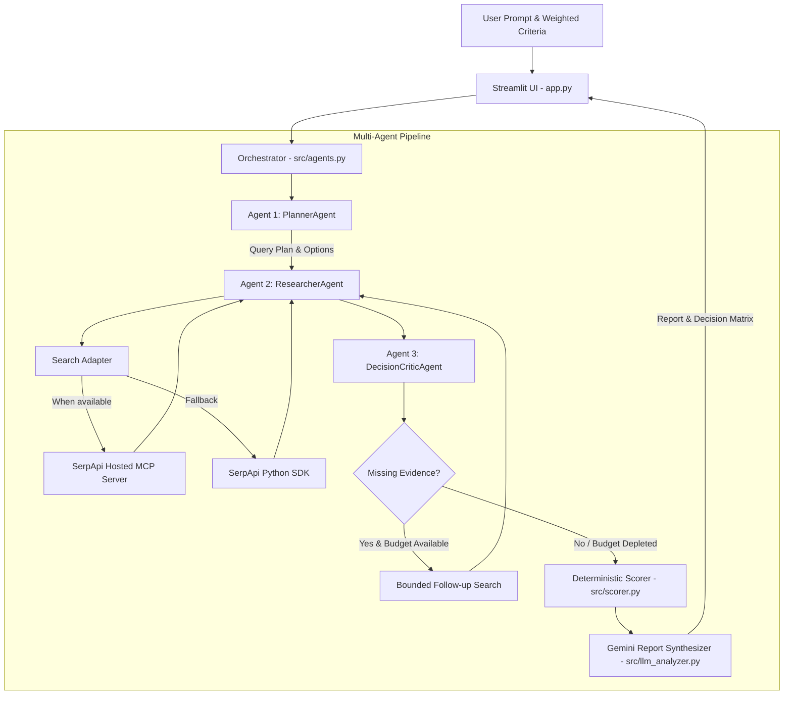

# 🚀 ResearchPilot AI: Multi-Agent Evidence & Decision System

**Official Submission for SerpApi India Hackathon 2026 — AI Agents Track**

ResearchPilot AI is an evidence-grounded multi-agent decision-support system for software architects, technical leads, researchers, and other decision-makers. It helps compare technologies using web-search evidence, a transparent weighted scoring engine, and an AI-generated report. The workflow uses **SerpApi search**, **Google Gemini**, and a deterministic scoring engine to produce recommendations with source links, trade-offs, and uncertainty notes.

## 🔗 Project Links

- **Demo Video:** [https://drive.google.com/file/d/1BWrjzm-QFC4UK1rVhhXiLWmo8NPisKYk/view?usp=drive_link]
- **Hackathon:** https://serpapi.github.io/serpapi-india-hackathon-2026/

---

## 🎯 Problem Statement & Solution

### The Challenge

Technical and purchasing decisions can be affected by:

1. **Search noise:** Search results may include marketing content, outdated articles, or duplicated information.
2. **LLM hallucinations:** AI models may state benchmarks, prices, or technical details without sufficient evidence.
3. **Single-prompt limitations:** A single prompt may not identify missing evidence or request targeted follow-up research.

### The ResearchPilot AI Solution

ResearchPilot AI uses a structured research workflow:

1. 🧠 **PlannerAgent:** Breaks the user's question into candidate options and targeted search queries.
2. 📡 **ResearcherAgent:** Retrieves web-search results through the SerpApi MCP integration when available, with a Python SDK fallback for connection failures or timeouts. Results are deduplicated by URL.
3. ⚖️ **DecisionCriticAgent:** Reviews evidence coverage against the user's criteria and identifies information gaps.
4. 🔄 **Bounded follow-up search:** When evidence is insufficient and the query budget allows, the workflow can run a targeted follow-up search.
5. 🏆 **Scoring and report:** A Python scoring engine calculates weighted scores, and Gemini helps produce an evidence-grounded report with source links and caveats.

---

## 🏗️ Multi-Agent Architecture



---

## ⭐ Key Features & Differentiators

- **SerpApi search integration:** Uses SerpApi MCP when available and falls back to the Python SDK when MCP requests fail or time out.
- **Research Watcher:** Stores research topics in a JSON watchlist, supports manual refreshes, and compares new evidence against a saved baseline.
- **Evidence drift detection:** Identifies changes such as URLs being added or removed, snippets changing, score shifts, and recommendation rank changes, with severity levels (`NONE`, `LOW`, `MEDIUM`, `HIGH`).
- **Lightweight in-memory RAG:** Uses embeddings and cosine-similarity ranking to retrieve relevant passage chunks for Gemini reasoning when embedding services are available.
- **RAG fallback:** Falls back to search-snippet context when embedding generation is unavailable.
- **Retrieval relevance labeling:** Distinguishes vector retrieval similarity from factual confidence.
- **Bounded follow-up loop:** Can perform a targeted follow-up search when evidence coverage is thin and the search budget allows.
- **Source URL preservation:** Keeps source URLs returned by search results so users can inspect the underlying pages.
- **Deterministic weighted scoring:** Calculates overall scores in Python rather than asking the language model to invent final rankings.
- **Untrusted-context handling:** Treats search snippets as external data rather than instructions.

---

## 🛠️ Project Structure

```text
ResearchPilot-AI/
├── app.py                     # Streamlit UI and agent workflow
├── test_search.py             # Standalone SerpApi integration test
├── requirements.txt           # Dependency manifest
├── .env.example               # Environment variables template
├── README.md                  # Project documentation
├── data/
│   └── .gitkeep               # Runtime watchlist storage directory
├── scripts/
│   └── watchlist_runner.py    # CLI watchlist runner
├── src/
│   ├── __init__.py
│   ├── agents.py              # Multi-agent orchestrator and role definitions
│   ├── mcp_adapter.py         # SerpApi MCP client
│   ├── search_engine.py       # Search wrapper with MCP and SDK fallback
│   ├── llm_analyzer.py        # Gemini integration and report generator
│   ├── rag_pipeline.py        # Chunking, embeddings, and similarity retrieval
│   ├── watchlist.py           # Watchlist persistence and CRUD operations
│   ├── drift_detector.py      # Evidence drift calculations
│   └── scorer.py              # Weighted decision scoring engine
└── tests/
    ├── test_agents.py         # Multi-agent workflow and budget tests
    ├── test_mcp_adapter.py    # MCP discovery, calls, and fallback tests
    ├── test_search_engine.py  # Search execution and URL preservation tests
    ├── test_llm_analyzer.py   # Gemini prompt isolation and fallback tests
    ├── test_rag_pipeline.py   # RAG chunking, embeddings, and fallback tests
    ├── test_watchlist.py      # Watchlist persistence tests
    ├── test_drift_detector.py # Evidence drift, score shifts, and rank-flip tests
    └── test_scorer.py         # Weighted scoring tests
```

---

## 🚀 Quick Start Guide

### 1. Prerequisites

- Python 3.13 or another Python version supported by the dependencies
- SerpApi API key: https://serpapi.com/
- Gemini API key: https://aistudio.google.com/

### 2. Clone the repository and set up the environment

```bash
git clone https://github.com/Ashutosh-Gadhave/ResearchPilot-AI.git
cd ResearchPilot-AI

python -m venv .venv
```

Activate the environment:

**Windows PowerShell**
```powershell
.\.venv\Scripts\Activate.ps1
```

**Windows Command Prompt**
```bat
.venv\Scripts\activate.bat
```

**Linux/macOS**
```bash
source .venv/bin/activate
```

Install dependencies:

```bash
python -m pip install -r requirements.txt
```

### 3. Configure API keys

Copy `.env.example` to `.env` and add your own API keys. Keep `.env` private and never commit real keys.

```env
SERPAPI_API_KEY=your_serpapi_key_here
GEMINI_API_KEY=your_gemini_key_here
```

### 4. Run the tests

```bash
python -m unittest discover tests -v
```

The tests use mocked external calls where configured. The command output is the source of truth for the number of tests passing in your current checkout.

### 5. Launch the application

```bash
python -m streamlit run app.py
```

Open the local URL printed in the terminal, usually `http://localhost:8501`.

---

## 🔌 SerpApi MCP Integration

- **Hosted endpoint:** `https://mcp.serpapi.com/mcp`
- **Transport:** JSON-RPC over HTTP, as implemented by the MCP adapter.
- **Authentication:** SerpApi API key via the configured authorization header.
- **Tool discovery and execution:** The adapter discovers available tools and attempts search calls.
- **Fallback:** The application can use the SerpApi Python SDK when MCP requests fail or time out.

**Reliability note:** MCP integration is implemented, but an MCP request may time out in some environments. In that case, the SDK fallback is used. Do not interpret a fallback search as proof that the MCP call itself succeeded.

---

## 🧮 Decision Scoring Methodology

ResearchPilot AI uses a normalized weighted scoring model:

\[
\text{Overall Score}(O) =
\frac{\sum_{c=1}^{N} \text{Weight}(c) \times \text{Score}(O,c)}
{\sum_{c=1}^{N} \text{Weight}(c)}
\]

Where:

- `Weight(c)` is the user-assigned importance of criterion `c`.
- `Score(O,c)` is the rating assigned to option `O` for criterion `c`, using the available evidence.
- Overall scores and rankings are calculated deterministically in Python.
- Criteria with insufficient evidence should be interpreted with the report's caveats or disclaimers.

The scoring engine makes the arithmetic reproducible; it does not guarantee that every search snippet is complete or independently verified.

---

## 🎬 Video Demonstration

The short demo video shows ResearchPilot AI running through a technology-comparison workflow. It highlights the multi-agent research process, SerpApi-powered evidence collection, the weighted decision matrix, cited source links, and research-monitoring features where shown in the recording.

**Demo video:** [https://drive.google.com/file/d/1BWrjzm-QFC4UK1rVhhXiLWmo8NPisKYk/view?usp=drive_link]

---

## ⚠️ Limitations & Future Improvements

- **Snippet-based evidence:** Analysis may rely on search-result snippets rather than full-page content. Important decisions should be checked against the original sources.
- **External service availability:** Search, Gemini, and embedding services can experience rate limits, timeouts, or temporary outages.
- **Bounded search budget:** Search calls are limited per workflow to manage response time and API usage.
- **Potential future improvements:** Full-page source extraction, stronger evidence quality checks, configurable search budgets, and more robust evaluation against reference decisions.

---

## 🤖 AI-Assisted Development Disclosure

This project was developed with AI-assisted tools. Update this list so it accurately reflects the tools you personally used and the role each played.

- **Google Antigravity:** AI-assisted coding and development environment, if used.
- **ChatGPT:** Development assistance, debugging, or documentation, if used.
- **Google Gemini API:** Model used by the application for research analysis and report synthesis.
- **SerpApi:** Search service used to retrieve web evidence.

The application integrates SerpApi MCP and includes a Python SDK fallback. This disclosure does not imply that every MCP request succeeds; runtime behavior depends on service availability.
