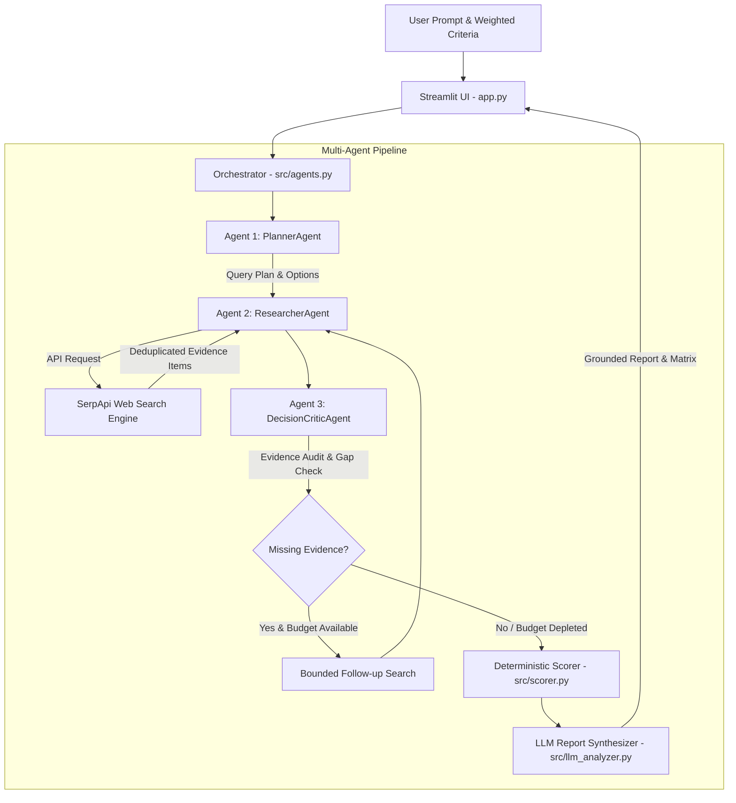

# 🚀 ResearchPilot AI: Multi-Agent Evidence & Decision System

**Official Submission for SerpApi India Hackathon 2026 — AI Agents Track**

ResearchPilot AI is an autonomous, evidence-grounded multi-agent decision system. It empowers software architects, technical leads, researchers, and strategic decision-makers to answer high-stakes comparative research questions. By orchestrating a specialized 3-agent workflow (**PlannerAgent**, **ResearcherAgent**, and **DecisionCriticAgent**) powered by **SerpApi Live Web Search**, **Google Gemini Intelligence**, and a **Deterministic Weighted Scoring Engine**, ResearchPilot AI transforms raw web search results into explainable, mathematical decision reports with verifiable source citations.

---

## 🎯 Problem Statement & Solution

### The Challenge
Modern technical and purchasing decisions suffer from:
1. **Search Noise & SEO Bias**: Traditional search engine results are bloated with sponsored marketing content and outdated comparison articles.
2. **LLM Hallucinations**: Standard AI models rely on static training data and hallucinate benchmarks, pricing, or obsolete technical specifications.
3. **Single-Prompt Limitations**: Single-shot LLM prompts fail to audit missing evidence or execute targeted follow-up queries when initial search results are incomplete.

### The ResearchPilot AI Multi-Agent Solution
ResearchPilot AI solves this through a structured 5-stage multi-agent pipeline:
1. 🧠 **PlannerAgent**: Deconstructs user prompt into candidate options and targeted search queries.
2. 📡 **ResearcherAgent**: Executes live web search via `serpapi-search-tools`, deduplicating results by URL.
3. ⚖️ **DecisionCriticAgent Audit**: Audits evidence coverage against user criteria and identifies missing information.
4. 🔄 **Bounded Follow-up Search**: If evidence is thin and search budget permits, executes 1 targeted follow-up search query.
5. 🏆 **Deterministic Scoring & Report**: Computes a mathematical weighted matrix $\text{Score} = \frac{\sum w_c \cdot s_c}{\sum w_c}$ normalizing options on a 1.0–5.0 scale, and generates an evidence-grounded decision report with clickable source links.

---

## 🏗️ Multi-Agent Architecture



---

## ⭐ Key Features & Differentiators

- **Multi-Agent Orchestration**: Specialized role separation (`PlannerAgent` $\rightarrow$ `ResearcherAgent` $\rightarrow$ `DecisionCriticAgent`) with explicit state passing (`ResearchState`) and gap auditing.
- **Bounded Follow-Up Loop**: Automatically detects thin evidence coverage and executes up to 1 targeted follow-up search without exceeding budget caps.
- **Unaltered Direct Source URLs**: Preserves original target URLs from SerpApi organic results without fabricating or truncating links.
- **Deterministic Weighted Scoring**: Computes mathematical score normalization ($1.0–5.0$ scale) in Python, ensuring LLMs do not invent overall scores or rankings.
- **Untrusted Context Defense**: Search result snippets are treated strictly as external data to prevent prompt override attacks.
- **Multi-Model Tier Fallback**: Automatic retries and fallback across model tiers (`gemini-2.5-flash` $\rightarrow$ `gemini-2.0-flash` $\rightarrow$ `gemini-1.5-flash`).

---

## 🛠️ Project Structure

```
ResearchPilot-AI/
├── app.py                     # Streamlit UI & real-time agent workflow status
├── test_search.py             # Standalone SerpApi integration test
├── requirements.txt           # Dependency manifest
├── .env.example               # Environment variables template
├── README.md                  # Project documentation & Hackathon submission report
├── src/
│   ├── __init__.py
│   ├── agents.py              # Multi-agent orchestrator & role definitions
│   ├── search_engine.py       # SerpApi search wrapper & domain extractor
│   ├── llm_analyzer.py        # Gemini client integration & report generator
│   └── scorer.py              # Deterministic weighted decision scoring engine
└── tests/
    ├── test_agents.py         # Unit tests for multi-agent workflow & budget limits
    ├── test_search_engine.py  # Unit tests for search execution & URL preservation
    ├── test_llm_analyzer.py   # Unit tests for Gemini prompt isolation & fallback
    └── test_scorer.py         # Unit tests for weighted decision scoring math
```

---

## 🚀 Quick Start Guide

### 1. Prerequisites
- Python 3.13+
- SerpApi API Key ([serpapi.com](https://serpapi.com))
- Gemini API Key ([aistudio.google.com](https://aistudio.google.com))

### 2. Setup Environment

```bash
# Clone project repository
git clone <repository-url>
cd ResearchPilot-AI

# Create virtual environment
python -m venv .venv

# Activate virtual environment
# On Windows:
.venv\Scripts\activate
# On Linux/macOS:
source .venv/bin/activate

# Install dependencies
pip install -r requirements.txt
```

### 3. Configure API Keys

Copy `.env.example` to `.env` and insert your API keys:

```env
SERPAPI_API_KEY=your_serpapi_key_here
GEMINI_API_KEY=your_gemini_key_here
```

### 4. Run Automated Unit Tests

Execute the automated test suite (23 tests, 100% mocked external calls):

```bash
python -m unittest discover tests -v
```

### 5. Launch Application

Start the Streamlit web dashboard:

```bash
streamlit run app.py
```

Open your browser to `http://localhost:8501`.

---

## 🧮 Decision Scoring Methodology

ResearchPilot AI uses a normalized weighted scoring model:

$$\text{Overall Score}(O) = \frac{\sum_{c=1}^{N} \text{Weight}(c) \times \text{Score}(O, c)}{\sum_{c=1}^{N} \text{Weight}(c)}$$

Where:
- $\text{Weight}(c) \in [1, 5]$: User-assigned importance for criterion $c$.
- $\text{Score}(O, c) \in [1.0, 5.0]$: LLM-assisted rating of option $O$ against criterion $c$ grounded in search evidence.
- Overall scores and rankings are calculated **100% deterministically in Python code**. Criteria with missing evidence are marked with `*` disclaimers.

---

## 📹 Video Demo Script (< 3 Minutes)

| Time | Segment | Script / Visual Guide |
| :--- | :--- | :--- |
| **0:00 - 0:30** | **Hook & Problem** | *"High-stakes tech decisions suffer from search noise and single-prompt LLM hallucinations. Meet ResearchPilot AI."* |
| **0:30 - 1:15** | **Multi-Agent Pipeline** | Demonstrate launching a prompt (*Postgres vs DuckDB*). Highlight real-time UI execution of **PlannerAgent** $\rightarrow$ **ResearcherAgent** $\rightarrow$ **DecisionCriticAgent**. |
| **1:15 - 2:15** | **Decision Matrix & Grounding** | Show the **Deterministic Decision Matrix**, explain the $1-5$ weighted scoring math, and click through verified **SerpApi source URLs**. |
| **2:15 - 2:45** | **Audit Loop & Test Suite** | Demonstrate how DecisionCriticAgent triggers 1 targeted follow-up search when evidence is thin, and show 23 passing unit tests. |
| **2:45 - 3:00** | **Closing** | *"ResearchPilot AI: Autonomous evidence-grounded decisions powered by SerpApi and Gemini. Thank you!"* |

---

## ⚠️ Limitations & Future Roadmap

- **Evidence Scope**: Evidence synthesis is currently based on organic search result snippets returned by SerpApi. Future releases will integrate full HTML page rendering.
- **Multi-Query Budget**: Search query budget is capped at 4 total queries per workflow run to maintain fast response times and quota efficiency.

---

## 🤖 AI-Assisted Development Disclosure

In accordance with hackathon rules, the development of ResearchPilot AI was assisted by:
- **Google Antigravity IDE**: AI agent pair-programming environment used for code architecture, refactoring, and test creation.
- **Gemini 3.6 Flash**: Core LLM model powering agent reasoning and decision synthesis.
- **SerpApi Search Tools SDK (`serpapi-search-tools`)**: Official SDK for real-time web search integration.
